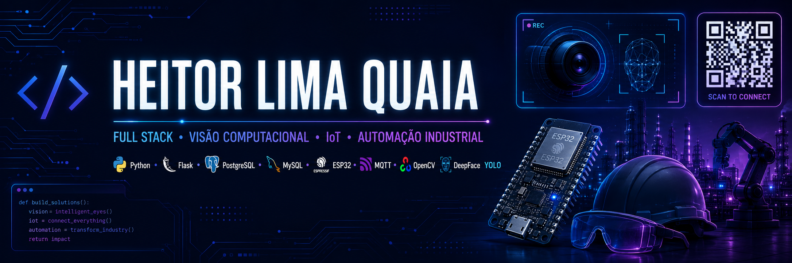

<p align="center">
  
</p>

<h1 align="center">Olá, eu sou o Heitor Lima Quaia 👋</h1>

<h3 align="center">
💻 Desenvolvedor Full Stack • 🤖 Visão Computacional • 📡 IoT • ⚙️ Automação Industrial
</h3>

<p align="center">
🎓 Cursando Tecnólogo em Automação Industrial
<br>
💻 Cursando Técnico em Desenvolvimento de Sistemas
<br>
⚙️ Formado como Técnico em Mecatrônica
</p>

<p align="center">
Estudante do SENAI Mariano Ferraz, apaixonado por tecnologia, desenvolvimento Full Stack,
IoT, Inteligência Artificial, Visão Computacional e Automação Industrial.
</p>

<br>

<p align="center">

<a href="mailto:heitor.lima75@gmail.com">

</a>

<a href="https://github.com/heitorlima75-dev">

</a>

</p>

---

# 👨‍💻 Sobre mim

- 🎓 Cursando Tecnologia em Automação Industrial
- 💻 Cursando Técnico em Desenvolvimento de Sistemas
- ⚙️ Formado como Técnico em Mecatrônica
- 🌐 Desenvolvedor Full Stack com Python, Flask, JavaScript, HTML e CSS
- 🤖 Desenvolvimento de soluções com Inteligência Artificial e Visão Computacional
- 👁️ Experiência com OpenCV, DeepFace e YOLO
- 📡 Desenvolvimento de sistemas IoT utilizando ESP32 e MQTT
- 📶 Comunicação MQTT utilizando o modelo Publish/Subscribe
- 🗄️ Experiência com PostgreSQL e MySQL
- 🚀 Sempre buscando aprender novas tecnologias e desenvolver projetos inovadores

---

# 🚀 Projetos em destaque

## 🔐 Sistema de Reconhecimento Facial com DeepFace

Sistema de controle de acesso desenvolvido em Python, utilizando webcam para realizar reconhecimento facial.

O sistema captura a imagem do usuário com OpenCV, realiza a identificação facial utilizando DeepFace, consulta os dados cadastrados no MySQL e envia o resultado para dispositivos IoT através do protocolo MQTT.

### Tecnologias

- Python
- DeepFace
- OpenCV
- Flask
- MySQL
- HTML
- CSS
- JavaScript
- MQTT
- ESP32

### Fluxo do sistema

```text
Webcam
   │
   ▼
OpenCV
   │
   ▼
DeepFace
   │
   ▼
Python
   │
   ▼
Flask
   │
   ▼
MySQL
   │
   ▼
MQTT Publish/Subscribe
   │
   ▼
ESP32
   │
   ▼
Acesso liberado ou negado
```

---

## 🦺 Sistema de Controle de Acesso com Verificação de EPIs

Projeto de controle de acesso para ambientes industriais utilizando leitura de QR Code, Visão Computacional e IoT.

O sistema identifica o colaborador através do QR Code presente no crachá, verifica automaticamente o uso de capacete e óculos de proteção utilizando YOLO e OpenCV e realiza a liberação ou o bloqueio do acesso através de ESP32 e MQTT.

### Tecnologias

- Python
- Flask
- OpenCV
- YOLO
- PostgreSQL
- HTML
- CSS
- JavaScript
- MQTT
- ESP32
- QR Code

### Fluxo do sistema

```text
Leitura do QR Code
        │
        ▼
Validação do colaborador
        │
        ▼
Captura da imagem
        │
        ▼
OpenCV
        │
        ▼
YOLO verifica os EPIs
        │
        ▼
Flask
        │
        ▼
PostgreSQL
        │
        ▼
MQTT Publish/Subscribe
        │
        ▼
ESP32
        │
        ▼
Acesso liberado ou negado
```

---

# 🛠️ Tecnologias e Ferramentas

## Linguagens

<p align="center">


</p>

---

## Backend

<p align="center">


</p>

---

## Banco de Dados

<p align="center">


</p>

---

## Visão Computacional

<p align="center">


</p>

---

## IoT e Comunicação

<p align="center">


</p>

---

## Ferramentas

<p align="center">


</p>

---


# 📊 Estatísticas

<p align="center">
  
</p>

<p align="center">
  
</p>

---


# 📈 Contribuições

<p align="center">
  
</p>

---

## 🐍 Snake das Contribuições

<p align="center">
  <picture>
    <source
      media="(prefers-color-scheme: dark)"
      srcset="https://raw.githubusercontent.com/heitorlima75-dev/heitorlima75-dev/gh-pages/github-contribution-grid-snake-dark.svg"
    />

    <source
      media="(prefers-color-scheme: light)"
      srcset="https://raw.githubusercontent.com/heitorlima75-dev/heitorlima75-dev/gh-pages/github-contribution-grid-snake.svg"
    />

    
  </picture>
</p>

--- 

# 👀 Visitantes

<p align="center">


</p>

---

# 🎯 Objetivos

- 🤖 Inteligência Artificial
- 👁️ Visão Computacional
- 📡 Internet das Coisas
- 🏭 Automação Industrial
- 🌐 Desenvolvimento Full Stack
- ☁️ Computação em Nuvem
- 🔐 Sistemas Inteligentes de Controle de Acesso
- 📊 Integração entre software, banco de dados e dispositivos IoT

---

<p align="center">
⭐ Obrigado por visitar meu perfil!
<br><br>
<i>"Transformando ideias em soluções através da programação, automação e tecnologia."</i>
</p>
